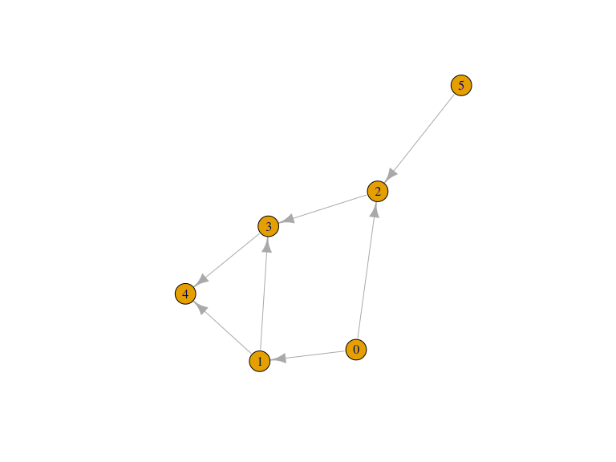

Installing the package
======================

*rpathsonpaths* is not on CRAN yet, therefore for now please install the development version of the package from *github*:

``` r
devtools::install_github("mhinsch/rpathsonpaths")
```

Note that this requires the package *devtools* installed.

What does it do?
================

*rpathsonpaths* provides functions to simulate the spread of a population in a substrate that itself is transported across a directed graph. The paradigmatic example is the spread of pathogens in food transport networks, but other instances might include for examples infections in migrating animals.

The most important functions include:

-   **`popsnetwork`**: create a network object from an edgelist (describing the transport graph) and a list of external sources.

-   **`set_allele_freq`**: set the population composition in source nodes.

-   **`spread_dirichlet`**: simulate spread of genetic material on the network using a Dirichlet distribution to approximate genetic drift.

-   **`draw_isolates`**: draw a number of random individuals from a set of nodes using the simulated allele frequencies.

-   **`plot`**: plot a *popsnetwork* object (currently uses igraph, but more backends are planned).

Resources
=========

Vignettes
---------

An overview of *rpathsonpaths* is provided below in the worked example below. More detailed tutorials are distributed as vignettes with the package:

``` r
vignette("overview", package="rpathsonpaths")
```

Websites
--------

The following websites are available:

-   The *rpathsonpaths* project on *github*, useful for developers, contributors, and users wanting to post issues, bug reports and feature requests: <br> [http://github.com/mhinsch/rpathsonpaths](http://github.com/reconhub/rpathsonpaths)

Getting help online
-------------------

Bug reports and feature requests should be posted on *github* using the [*issue*](http://github.com/mhinsch/rpathsonpaths/issues) system.

A quick overview
================

The following worked example provides a brief overview of the package's functionalities. See the [*vignettes section*](#vignettes) for more detailed tutorials.

Preparing the network
---------------------

First, we prepare an edge list describing the network, and the initial state of the source nodes:

``` r
library(rpathsonpaths)

inp <- c(0L, 0L, 1L, 2L, 3L, 1L, 5L)
outp <- c(1L, 2L, 3L, 3L, 4L, 4L, 2L)
rates <- c(1, 1.5, 0.5, 0.1, 1, 0.1, 0.5)
edgelist <- data.frame(inp, outp, rates)
ext <- data.frame(c(0L, 5L), c(0.5, 0.5))
```

Now we can create a *popsnetwork* object:

``` r

netraw <- popsnetwork(edgelist, ext, 0.1)
netraw
#> Nodes:
#> 
#> id   infected    input   alleles...
#> 0    0.5 1
#> 1    0.55    1
#> 2    1.1 2
#> 3    0.357   0.6
#> 4    0.695   1.1
#> 5    0.5 1
#> 
#> Links:
#> 
#> from to  rate    infected
#> 0    1   1   0.5
#> 0    2   1.5 0.75
#> 1    3   0.5 0.275
#> 2    3   0.1 0.055
#> 3    4   1   0.595
#> 1    4   0.1 0.055
#> 5    2   0.5 0.25
plot(netraw)
#> Loading required namespace: igraph
```



Injecting initial populations and simulating spread
---------------------------------------------------

We set up the initial populations of the source nodes:

``` r
freqs <- matrix(c(0.1, 0.4, 0.3, 0.1, 0.2, 0.2, 0.4, 0.3), ncol=4, nrow=2)
netini <- set_allele_freqs(netraw, list(c(0L, 5L), freqs))
netini
#> Nodes:
#> 
#> id   infected    input   alleles...
#> 0    0.5 1   0.1 0.3 0.2 0.4
#> 1    0.55    1
#> 2    1.1 2
#> 3    0.357   0.6
#> 4    0.695   1.1
#> 5    0.5 1   0.4 0.1 0.2 0.3
#> 
#> Links:
#> 
#> from to  rate    infected
#> 0    1   1   0.5
#> 0    2   1.5 0.75
#> 1    3   0.5 0.275
#> 2    3   0.1 0.055
#> 3    4   1   0.595
#> 1    4   0.1 0.055
#> 5    2   0.5 0.25
```

Now we are ready to simulate spread of genetic material in the network. Note that every call to spread\_dirichlet will generally produce a different allele frequency distribution.

``` r
netdir1 <- spread_dirichlet(netini, 1.7)
netdir1
#> Nodes:
#> 
#> id   infected    input   alleles...
#> 0    0.5 1   0.1 0.3 0.2 0.4
#> 1    0.55    1   0.581491    0.0836394   0.247641    0.087228
#> 2    1.1 2   0.0335044   0.0132191   0.734967    0.218309
#> 3    0.357   0.6 0.209466    1.51252e-09 0.76164 0.0288939
#> 4    0.695   1.1 0.0399902   0.00320033  0.956113    0.000696709
#> 5    0.5 1   0.4 0.1 0.2 0.3
#> 
#> Links:
#> 
#> from to  rate    infected
#> 0    1   1   0.5
#> 0    2   1.5 0.75
#> 1    3   0.5 0.275
#> 2    3   0.1 0.055
#> 3    4   1   0.595
#> 1    4   0.1 0.055
#> 5    2   0.5 0.25
netdir2 <- spread_dirichlet(netini, 1.7)
netdir2
#> Nodes:
#> 
#> id   infected    input   alleles...
#> 0    0.5 1   0.1 0.3 0.2 0.4
#> 1    0.55    1   0.000158453 0.901049    0.076847    0.0219456
#> 2    1.1 2   0.0287876   0.246972    0.496926    0.227314
#> 3    0.357   0.6 5.18836e-12 0.764499    0.199804    0.0356975
#> 4    0.695   1.1 6.1135e-127 0.999998    1.21166e-06 2.9427e-07
#> 5    0.5 1   0.4 0.1 0.2 0.3
#> 
#> Links:
#> 
#> from to  rate    infected
#> 0    1   1   0.5
#> 0    2   1.5 0.75
#> 1    3   0.5 0.275
#> 2    3   0.1 0.055
#> 3    4   1   0.595
#> 1    4   0.1 0.055
#> 5    2   0.5 0.25
```

Drawing samples
---------------

Finally we can draw samples from our simulated population.

``` r
samplconf <- data.frame(nodes=c(2L, 4L), N=c(10L, 10L))
draw_isolates(netdir1, samplconf)
#>   node allele_0 allele_1 allele_2 allele_3
#> 1    2        0        0        7        3
#> 2    4        0        1        9        0
draw_isolates(netdir2, samplconf)
#>   node allele_0 allele_1 allele_2 allele_3
#> 1    2        0        5        3        2
#> 2    4        0       10        0        0
```

Contributors (in alphabetic order):
===================================

-   [Martin Hinsch](https://github.com/mhinsch)
-   [Thibaut Jombart](https://github.com/thibautjombart)

See details of contributions on: <br> <https://github.com/mhinsch/rpathsonpaths/graphs/contributors>

Contributions are welcome via **pull requests**.

Please note that this project is released with a [Contributor Code of Conduct](CONDUCT.md). By participating in this project you agree to abide by its terms.

**Maintainer:** Martin Hinsch (<hinsch.martin@gmail.com>)
